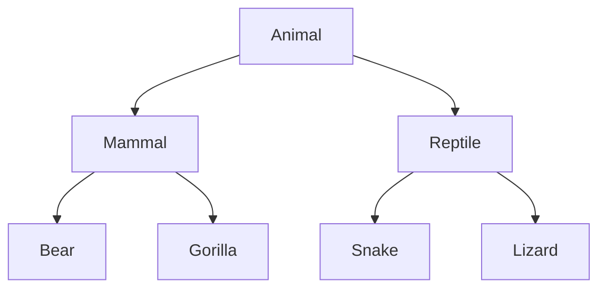
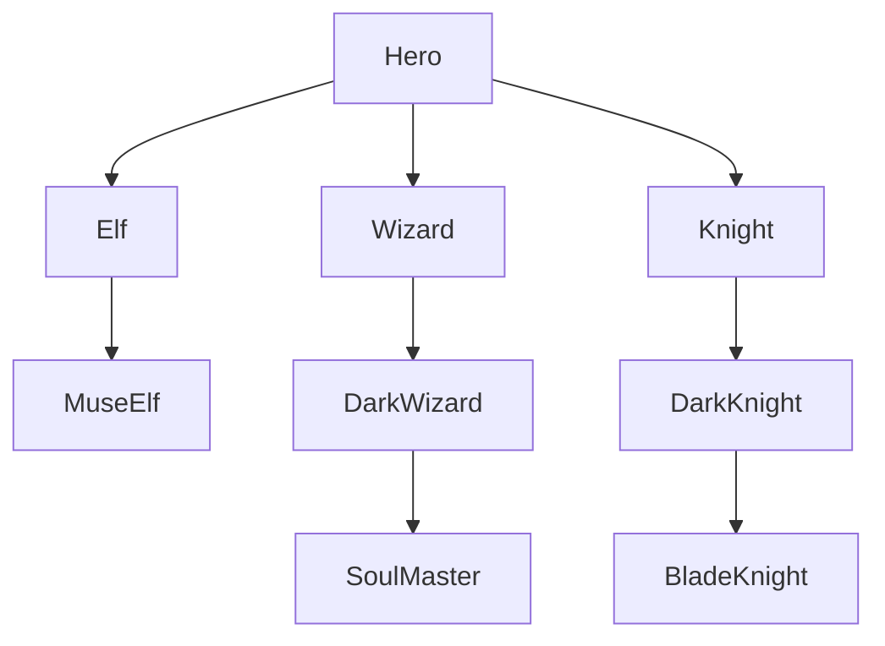
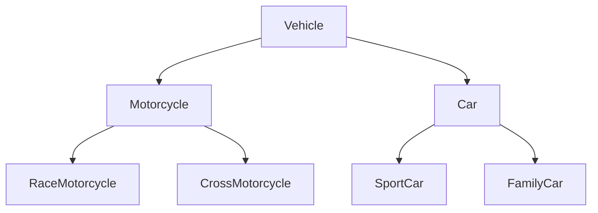

# 01. Person
You are asked to model an application for storing data about people. You should be able to have a person and a child. The child derives from the person.<br/> 
Your task is to model the application. The only constraints are:
 - People should not be able to have a negative age
 - Children should not be able to have an age greater than 15.
- Person – represents the base class by which all of the others are implemented
- Child - represents a class, which derives from Person.

**Note**

Your class’s names MUST be the same as the names shown above!!
```ruby
static void Main()

{

string name = Console.ReadLine();

int age = int.Parse(Console.ReadLine());

Child child = new Child(name, age);

Console.WriteLine(child);

}
```

**Examples:**
<table >
	<tbody>
		<tr>
			<td>Input </td>
			<td>Output </td>
		</tr>
		<tr>
			<td>Peter<br/>12 </td>
			<td>Name: Peter, Age: 13 </td>
		</tr>
	</tbody>
</table>

# 02. Zoo
NOTE: You need a public class StartUp.

Create a project Zoo. It needs to contain the following classes:

Follow the diagram and create all of the classes. Each of them, except the Animal class, should inherit from another class. Every class should have:
- A constructor, which accepts one parameter: name.
- Property Name - string.

# 03. Players and Monsters
NOTE: You need a public class StartUp.

Your task is to create the following game hierarchy:


Create a class Hero. It should contain the following members:
- A constructor, which accepts:
  * username – string
  * level – int
- The following properties:
  * Username - string
  * Level – int
- ToString() method

Hint: Override ToString() of the base class in the following way
```ruby
public override string ToString()

{

return $"Type: {this.GetType().Name} Username: {this.Username} Level: {this.Level}";

}
```

# 04. Need for Speed
NOTE: You need a public class StartUp. Create the following hierarchy with the following classes:


Create a base class Vehicle. It should contain the following members:
- A constructor that accepts the following parameters: int horsePower, double fuel
- DefaultFuelConsumption – double
- FuelConsumption – virtual double
- Fuel – double
- HorsePower – int
- virtual void Drive(double kilometers)
  * The Drive method should have a functionality to reduce the Fuel based on the traveled kilometers.

The default fuel consumption for Vehicle is 1.25. Some of the classes have different default fuel consumption values:
- SportCar – DefaultFuelConsumption = 10
- RaceMotorcycle – DefaultFuelConsumption = 8
- Car – DefaultFuelConsumption = 3

# 05. Restaurant
NOTE: You need a public class StartUp. Create a Restaurant project with the following classes and hierarchy:

There are Food and Beverages in the restaurant, and they are all products.

The Product class must have the following members:
- A constructor with the following parameters:
  - Name – string
  - Price – decimal

Beverage and Food classes are products.

The Beverage class must have the following members:
- A constructor with the following parameters: string name, decimal price, double milliliters
  - Reuse the constructor of the inherited class
- Name – string
- Price – decimal
- Milliliters – double

HotBeverage and ColdBeverage are beverages and they accept the following parameters upon initialization: string name, decimal price, double milliliters. 
Reuse the constructor of the inherited class.

Coffee and Tea are hot beverages. The Coffee class must have the following additional members:
- double CoffeeMilliliters = 50
- decimal CoffeePrice = 3.50
- Caffeine – double

The Food class must have the following members:
- A constructor with the following parameters: string name, decimal price, double grams
  - Name – string
  - Price – decimal
  - Grams – double

MainDish, Dessert, and Starter are food. They all accept the following parameters upon initialization: string name, decimal price, double grams.<br/>
Reuse the base class constructor.

Dessert must accept one more parameter in its constructor: double calories, and has a property:
- Calories

Make Fish, Soup and Cake inherit the proper classes.

The Cake class must have the following default values:
- Grams = 250
- Calories = 1000
- CakePrice = 5

A Fish must have the following default values:
- Grams = 22

# 06. Animals
You need a public class StartUp.Create a hierarchy of Animals. Your program should have three different animals – Dog, Frog, and Cat.<br/>
Deeper in the hierarchy you should have two additional classes – Kitten and Tomcat. Kittens are female and Tomcats are male.<br/> 
All types of animals should be able to produce some kind of sound - ProduceSound(). For example, the dog should be able to bark.<br/> 
Your task is to model the hierarchy and test its functionality. Create an animal of each kind and make them all produce sound.

You will be given some lines of input. Every two lines will represent an animal.<br/> 
On the first line will be the type of animal and on the second – the name, the age, and the gender. When the command "Beast!" is given,<br/> 
stop the input and print all the animals in the format shown below.

**Output**
- Print the information for each animal on three lines. On the first line, print: "{AnimalType}"
- On the second line print: "{Name} {Age} {Gender}"
- On the third line print the sounds it produces: "{ProduceSound()}"

**Constraints**
- Each Animal should have a name, an age, and a gender
- All input values should not be blank (e.g. name, age, and so on…)
- If you receive an input for the gender of a Tomcat or a Kitten, ignore it but create the animal
- If the input is invalid for one of the properties, throw an exception with the message: "Invalid input!"
- Each animal should have the functionality to ProduceSound()
- Here is the type of sound each animal should produce:
  - Dog: "Woof!"
  - Cat: "Meow meow"
  - Frog: "Ribbit"
  - Kittens: "Meow"
  - Tomcat: "MEOW" 
